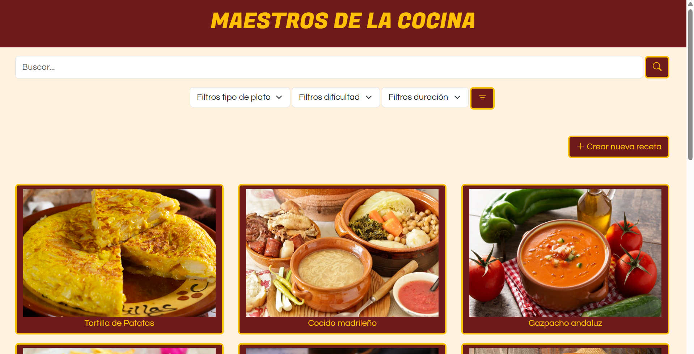
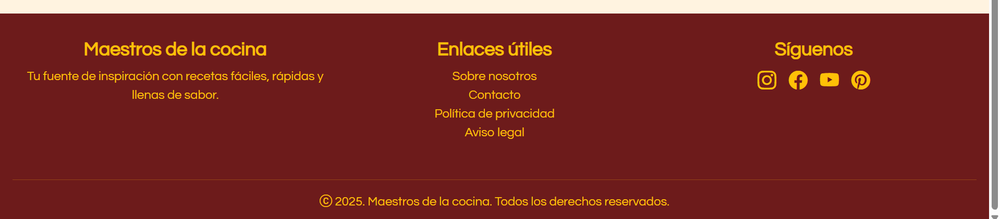
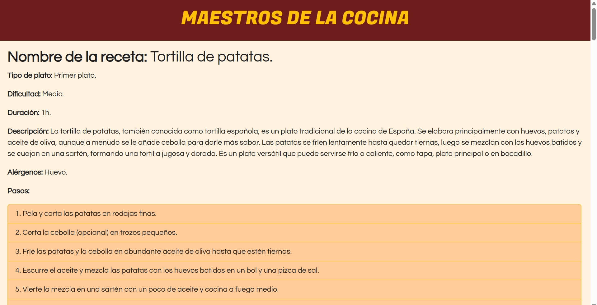
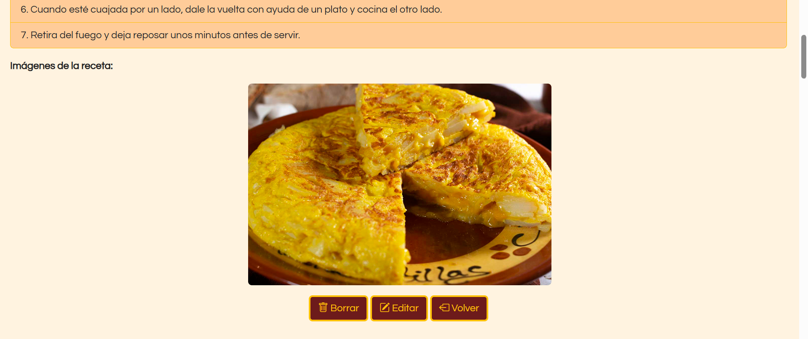
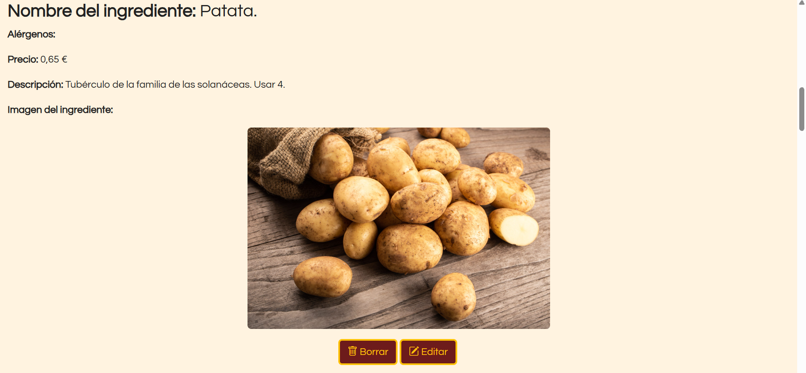
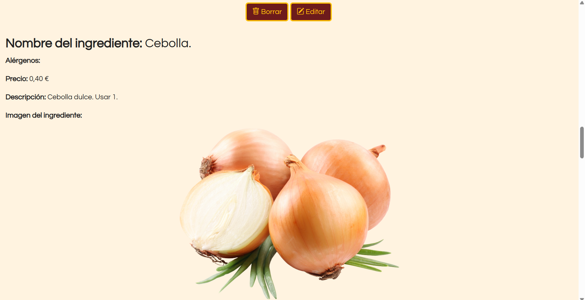
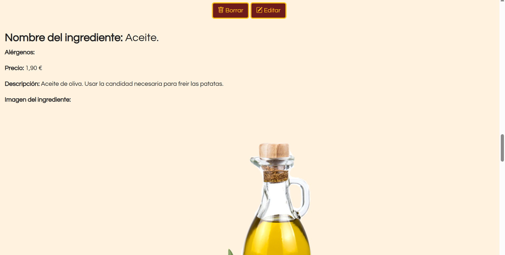
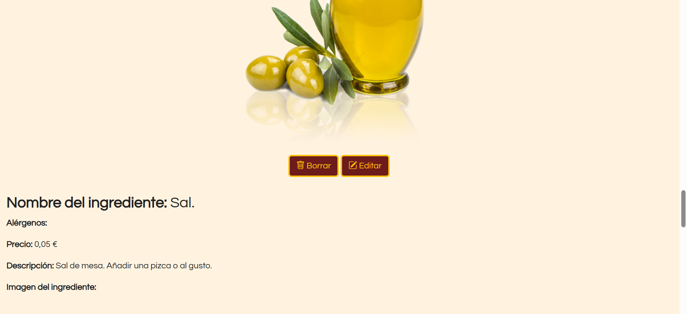
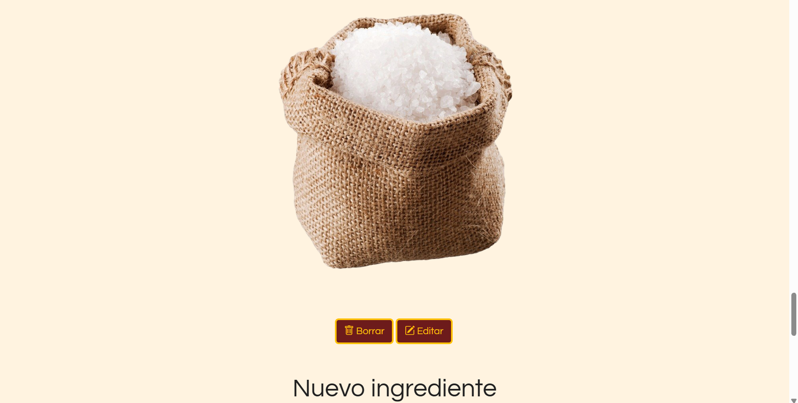
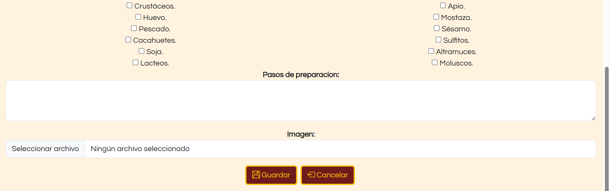

# MAESTROS DE LA COCINA
### Descripción: 
Maestros de la cocina es una web con formato de catálogo de recetas.

### Integrantes 
- Miguel de Luis Ibáñez --- m.deluis.2024@alumnos.urjc.es --- mmddll8
- Hugo García Palomo --- h.garciap.2024@alumnos.urjc.es --- Hugo-56
- Lucas Román Jiménez --- l.roman.2024@alumnos.urjc.es --- Lucas-Roman-Jimenez

# Funcionalidad
## Entidades
Entidad principal: receta del plato a cocinar. `Recipe`

Atributos de la entidad principal:
1. Nombre. (Ejemplo: "Tortilla de patatas") `Name`
2. Tipo de plato. (Ejemplo: "Primer plato") `Dish: Starter/Side/Main/Dessert`
3. Dificultad. (Ejemplo: "Fácil") `Difficulty: Easy/Medium/Hard`
4. Duración. (Ejemplo: "30min") `Length: 5min/15min/30min/45min/1h/2h/3h/+3h`
5. Descripción. `Description`
6. Alérgenos. `Allergens: Gluten-Crustacean-Eggs-Fish-Peanuts-Soya-Dairy-Nuts-Celery-Mustard-Sesame-Sulfites-Lupin-Mollusk`
7. Pasos de la preparación. `Steps`
8. Imágenes del plato. `Images`

Entidad secundaria ligada a la principal: ingrediente. `Ingredients` 

Atributos de la entidad secundaria:
1. Nombre. (Ejemplo: "Patatas") `Name`
2. Alérgenos. `Allergens: Gluten-Crustacean-Eggs-Fish-Peanuts-Soya-Dairy-Nuts-Celery-Mustard-Sesame-Sulfites-Lupin-Mollusk`
3. Precio aproximado del ingrediente. `Price`
4. Descripción. `Description`
5. Imagen del ingrediente. `Image`

La relación entre la entidad principal y la secundaria se da ya que es necesaria una lista de ingredientes para realizar una receta.

## Funcionalidades para el usuario
El objetivo es incluir un buscador por nombre para encontrar recetas, además de filtros para buscar por:
- Tipo de plato. `Dish: Starter/Side/Main/Dessert`
- Dificultad. `Difficulty: Easy/Medium/Hard`
- Duración. `Length: 5min/15min/30min/45min/1h/2h/3h/+3h`

Además, se pretende que el usuario pueda añadir sus propias recetas.

# Práctica 1
## Capturas de pantalla
### Página principal:

### Página de detalle: 

### Página de nuevo elemento:

## Participación de cada miembro
### Miguel de Luis Ibáñez:
- He trabajado en la primera versión de la página de detalle (`DetailPage`), añadí el grid de Bootstrap para el diseño responsive y el footer en la página principal (`MainPage`), realicé los formularios de: 1) Nueva Receta (`NewItemPage`) y 2) Nuevo Ingrediente (`DetailPage`) con Bootstrap para que sean ambos responsive. Solucioné errores en los botones del footer de la página de detalle, posteriormente actualicé los formularios con especificaciones y añadí la opción de añadir imagenes y por último añadí las fuentes de las letras tanto como para el header como para el resto.

- Los commits más importantes que he hecho son:

1) Formulario de nuevo ingrediente  (https://github.com/CodeURJC-FW-2025-26/webapp03/commit/58d87f89f3f2890d4958b738841a5ce0ab6d00bc)

2) Formulario de nueva receta (https://github.com/CodeURJC-FW-2025-26/webapp03/commit/737bb647b2104d6d09ada8e16896e4b3db8748e3)

3) Primer modelo de la página de detalle (https://github.com/CodeURJC-FW-2025-26/webapp03/commit/fb15179145e38c3c5eea7475623011505bd077a3)

4) Grid y footer de la página principal (https://github.com/CodeURJC-FW-2025-26/webapp03/commit/08b16050227faed5b7105703171e34a616f0a41e)

5) Añadir imágenes (https://github.com/CodeURJC-FW-2025-26/webapp03/commit/de5bc34a86803f2980ce5f8c1e423d906e7504b4)

- Los ficheros en los que más he trabajado son:

1) `DetailPage` (https://github.com/CodeURJC-FW-2025-26/webapp03/blob/main/DetailPage.html)

2) `MainPage` (https://github.com/CodeURJC-FW-2025-26/webapp03/blob/main/MainPage.html)

3) `NewItemPage` (https://github.com/CodeURJC-FW-2025-26/webapp03/blob/main/NewItemPage.html)

4) `Styles` (CSS) (https://github.com/CodeURJC-FW-2025-26/webapp03/blob/main/Styles.css)

5) `README` (https://github.com/CodeURJC-FW-2025-26/webapp03/blob/main/README.md)

### Lucas Román Jiménez:
- Hice la primera versión del formulario de la página de nuevo elemento (`NewItemPage`) en html. También añadí los footers finales de las tres páginas (`NewItemPage`, `DetailPage` y `MainPage`). He realizado gran parte de los ejemplos de ingredientes, agregando imágenes y rellenando los campos de texto con la información de cada uno. Implementé el Bootstrap en parte de la página de detalle (`DetailPage`). Y por último corregí errores en la información que aparece en los ingredientes y recetas.

- Los commits más importantes que he hecho son:

1) Footer definitivo de todas las páginas (https://github.com/CodeURJC-FW-2025-26/webapp03/commit/19558b0144c69fe7eb1a557b548b68e065246462)

2) Primera versión del formulario de nueva receta (https://github.com/CodeURJC-FW-2025-26/webapp03/commit/01a68c5a8da9e582447fd9c03bc78e145fceae49)

3) Introducir en la página de detalle el Bootstrap (https://github.com/CodeURJC-FW-2025-26/webapp03/commit/87944566dbfd9da0cd2d705a51dbcc520d764dbd)

4) Añadir imagenes para los ingredientes (https://github.com/CodeURJC-FW-2025-26/webapp03/commit/e2c093a7339551f41940f4e457b4795a329e6a6d)

5) Arreglar errores en el texto de las recetas (https://github.com/CodeURJC-FW-2025-26/webapp03/commit/8df4ab2bf57ff1f88d246a3f7c47020b762165cf)

- Los ficheros en los que más he trabajado son:

1) `NewItemPage` (https://github.com/CodeURJC-FW-2025-26/webapp03/blob/main/NewItemPage.html)

2) `DetailPage` (https://github.com/CodeURJC-FW-2025-26/webapp03/blob/main/DetailPage.html)

3) `Styles` (CSS) (https://github.com/CodeURJC-FW-2025-26/webapp03/blob/main/Styles.css)

4) `MainPage` (https://github.com/CodeURJC-FW-2025-26/webapp03/blob/main/MainPage.html)

5) `README` (https://github.com/CodeURJC-FW-2025-26/webapp03/blob/main/README.md)

### Hugo García Palomo:
- Me he encargado de gran parte de los estilos, mediante el archivo CSS correspondiente (`Styles`) y aplicando las clases y estilos de Bootstrap necesarios, así como revisar su correcta aplicación en cada página. También he diseñado los botones en general de todas las páginas y los elementos del grid, la barra de busqueda y los filtros de la página principal (`MainPage`). Finalmente me he encargado de la revisión y corrección de errores de mayor o menor importancia en cada uno de los archivos.

- Los commits más importantes que he hecho son:

1) Añadir barra de búsqueda y selectores de filtros, además de corrección de errores (https://github.com/CodeURJC-FW-2025-26/webapp03/commit/e83014d4bb806092a3784b4a0c9f83b1276b17bf)

2) Mejoras de estilos y del footer, además de la organización del código (https://github.com/CodeURJC-FW-2025-26/webapp03/commit/aa66079143da89e6f5422cd3f07a2ebdbaf35830)

3) Mejoras de los botones y los formularios para adaptarse a la descripción del README (https://github.com/CodeURJC-FW-2025-26/webapp03/commit/1142a5cc0e714a9845bc0ba40990d51da8926496)

4) Boton de crear nuevo elemento y botones con imagenes (https://github.com/CodeURJC-FW-2025-26/webapp03/commit/d0872a068ad584555f7fe862457f28c2a20dd2e2)

5) Mejoras en el grid, pruebas de imagenes y correción de colores (https://github.com/CodeURJC-FW-2025-26/webapp03/commit/e3a497e95215755aa6de13425e9b24727073793f)

- Los ficheros en los que más he trabajado son:

1) `MainPage` (https://github.com/CodeURJC-FW-2025-26/webapp03/blob/main/MainPage.html)

2) `Styles` (CSS) (https://github.com/CodeURJC-FW-2025-26/webapp03/blob/main/Styles.css)

3) `NewItemPage` (https://github.com/CodeURJC-FW-2025-26/webapp03/blob/main/NewItemPage.html)

4) `DetailPage` (https://github.com/CodeURJC-FW-2025-26/webapp03/blob/main/DetailPage.html)

5) `README` (https://github.com/CodeURJC-FW-2025-26/webapp03/blob/main/README.md)

# Práctica 2

## Instrucciones de ejecución:
Una vez descargada la Practica2, desde un terminal hay que acceder a su directorio. Una vez en él, es necesario ejecutar `npm install` para descargar las bibliotecas necesarias. Para iniciar la aplicación se puede usar directamente el comando `node src/app.js` o si se prefiere el equivalente `npm run start` o `npm run watch` para usar nodemon si se quieren probar cambios de forma más cómoda. 
Los requisitos son:
- Node: v22.21.0
- Mongo: ^6.20.0
- Express: 5.1.0,
- Multer: 2.0.2,
- Mustache-express: 1.3.2

## Descripción de ficheros:
Carpeta data:
- Images: carpeta con imagenes de ejemplo que se cargan al inicar.

- data.json : fichero json en el que se encuentran los datos que se cargar al inicar la aplicación para la demo de la práctica.

Carpeta public:
- Style.css : fichero para implementar estilos al html.

Carpeta src:
- app.js : fichero JavaScript necesario para inicializar correctamente la aplicación e importar las librerias necesarias.

- load_data.js : fichero JavaScript con el que se cargan los datos de la demo que se encuentran en la base de datos de MongoDB

- recipesDB.js : fichero en el que se encuentran las funciones necesarias para interactuar con la base de datos.

- router.js : fichero en el que se almacena las funciones a realizar con sus respectivas rutas a las vistas.

Carpeta views: 
- DetailPage.html : fichero con la vista de la DetailPage.

- ErrorFormulary.html : fichero con la vista de la ErrorFormulary.

- Footer.html: fichero con la plantilla del footer.

- Header.html: fichero con la plantilla del header.

- MainPage.html : fichero con la vista de la MainPage.

- NewItemPage.html : fichero con la vista de la NewItemPage.

- RecipeConfirmation.html: fichero con la vista de la RecipeConfirmation.

## Vídeo demostrativo

Enlace a youtube con el vídeo demostrativo: https://youtu.be/1RXj2QLhdmg.

## Participación de los miembros

### Lucas Román Jiménez

- He creado la paginas de ErrorFormulary implementando el mostrado de errores, e implementado los botones de la página para que al volver, el usuario llegue al formulario en el que dió error. También he implementado la validación de la base de datos para las entidades principales y las secundarias. Para esto último, también cree dos funciones en el recipesDB. Hice también los botones provisionales de la RecipeConfirmation. 

- Los commits más importantes que he hecho son:

1) Validación de las recetas en MongoDB (https://github.com/CodeURJC-FW-2025-26/webapp03/commit/ac4468026e8094c544785d481754fd83c70f6a61)

2) Validación de los ingredientes (https://github.com/CodeURJC-FW-2025-26/webapp03/commit/98a7821eecb0716d3dd30c8d2c4f0c4f1e20066e)

3) Arreglar errores en las validaciones y el ErrorFormulary (https://github.com/CodeURJC-FW-2025-26/webapp03/commit/22d2b2ef5dc11eb5dfcdae9800c7a1de6d863d77)

4) Cambio de formato de los errores en las validaciones (https://github.com/CodeURJC-FW-2025-26/webapp03/commit/9578d93e3926b8e437bfded5eab9fbe3029c9e1c)

5) Botones provisionales de RecipeConfirmation (https://github.com/CodeURJC-FW-2025-26/webapp03/commit/ec161bb51cba10eeb6db805311db7fdcf92197b8)

- Los ficheros en los que más he trabajado son: 

1) `Router`

2) `RecipesDB`

3) `Error Formulary`

4) `Recipe Confirmation`

5) `README`

### Miguel de Luis Ibáñez

- He trabajado en añadir la correcta funcionalidad de los formularios de la entidad principal y entidad secundaria, he trabajado sobre los "form" y "method" de la Main Page, he implementado los botones de la pagina Recipe Confirmation, la forma en la que se muestra la entidad principal en su pagina de detalle (que sea dinamica respecto a la receta que se quiera ver), los botones de delete de las entidades principal como secundaria entre otras cosas.

- Los commits más importantes que he hecho son:

1) Añadir la funcionalidad antes mencionado en la Detail Page (https://github.com/CodeURJC-FW-2025-26/webapp03/commit/338747130564798f9f1a1152c72565ecbfae89fc)

2) Añadir los botones de la Recipe Confirmation (https://github.com/CodeURJC-FW-2025-26/webapp03/commit/f09f0916b0a6e92792e1769deac3962eeee2cc1a)

3) Formulario de la entidad principal (https://github.com/CodeURJC-FW-2025-26/webapp03/commit/9c86c2e5409165905143c637c4e8b53b20fe98c4)

4) Formulario de nueva entidad secundaria (https://github.com/CodeURJC-FW-2025-26/webapp03/commit/e141835fdfcf1aa0e060129edf60f6c9e3d06163)

5) Boton borrar entidad principal (https://github.com/CodeURJC-FW-2025-26/webapp03/commit/bf0701721b23afa71667f94804be86b7b438e49a)

- Los ficheros en lo que más he trabajado son:

1) `Detail Page`

2) `New Recipe Page`

3) `Confirmation Page`

4) `Main Page`

5) `RecipesDB`

### Hugo García Palomo

- He trabajado en implementar las funciones de la página principal, como el buscador y los botones de secciones. Además de la paginación y que se muestren las recetas correctamente y se pueda acceder a sus secciones. También he implementado las funciones de editar receta e ingredientes. He programado diversas funciones para interactuar con la base de datos como mostrar imagenes dinámicas según la receta. Además de corregir diversos errores y bugs.

- Los commits más importantes que he hecho son: 

1) Función de editar ingrediente (https://github.com/CodeURJC-FW-2025-26/webapp03/commit/ffe5632a7f789b4425b7d17f11c509f1f60b6d18)

2) Función de editar receta (https://github.com/CodeURJC-FW-2025-26/webapp03/commit/7c1aa94cb6c040718cb693c41886b1a0fe5fb7ce)

3) Buscador por secciones (https://github.com/CodeURJC-FW-2025-26/webapp03/commit/02badd301c5bdab26392f4741846e8c746777807)

4) Barra de busqueda (https://github.com/CodeURJC-FW-2025-26/webapp03/commit/cba549139c0eeb78c682b76f14edfdf63bc0547d)

5) Paginación (https://github.com/CodeURJC-FW-2025-26/webapp03/commit/722fa87e33887a5d76c831eb4370b7fde80cc665)

- Los ficheros en los que más he trabajado son:

1) `router.js`

2) `recipesDB.js`

3) `MainPage.html`

4) `DetailPage`

5) `data.json`

#Práctica 3

###Lucas Román Jiménez

- He trabajado en la primera versión de la validación de los pasos de la receta en el cliente. También he hecho la validación de los ingredientes en el cliente. He Cambiado también los ejemplos en el data.json para que salgan diferentes recetas al entrar en la web.

- Los commits más importantes que he hecho son:

  1) Validación de los ingredientes en el cliente (https://github.com/CodeURJC-FW-2025-26/webapp03/commit/e6512543129dc90a98315db34e2053c463bd74af)

  2) Primera versión de la validación de los pasos de la receta (https://github.com/CodeURJC-FW-2025-26/webapp03/commit/c29a9d07720d93964a93aac437c65921ce82066f)

  3) Nuevas recetas en el data.json (https://github.com/CodeURJC-FW-2025-26/webapp03/commit/ba6207ed8f470bc2786eec2f804dcc69af146f0c)

  4) Imágenes para los ingredientes (https://github.com/CodeURJC-FW-2025-26/webapp03/commit/ba1315e63d35f46473c2074e37e53820442fe91d)

  5) Imágenes para las recetas (https://github.com/CodeURJC-FW-2025-26/webapp03/commit/29f3de600d75bc713f964c2c6a3dafa416f84a14)

- Los ficheros en los que más he trabajado son:

1) `app.js`

2) `data.json`

3) `Images`

4) `DetailPage`

5) `ReadMe`

# Práctica 3

## Instrucciones de ejecución:
Una vez descargada la Practica2, desde un terminal hay que acceder a su directorio. Una vez en él, es necesario ejecutar `npm install` para descargar las bibliotecas necesarias. Para iniciar la aplicación se puede usar directamente el comando `node src/app.js` o si se prefiere el equivalente `npm run start` o `npm run watch` para usar nodemon si se quieren probar cambios de forma más cómoda. 
Los requisitos son:
- Node: v22.21.0
- Mongo: ^6.20.0
- Express: 5.1.0,
- Multer: 2.0.2,
- Mustache-express: 1.3.2

## Descripción de ficheros:
Carpeta data:
- Images: carpeta con imagenes de ejemplo que se cargan al inicar.

- data.json : fichero json en el que se encuentran los datos que se cargar al inicar la aplicación para la demo de la práctica.

Carpeta public:
- Style.css : fichero para implementar estilos al html.

-app.js : fichero JavaScript encargado de las funciones del frontend para mejorar la experiencia del usuario.

Carpeta src:
- app.js : fichero JavaScript necesario para inicializar correctamente la aplicación e importar las librerias necesarias.

- load_data.js : fichero JavaScript con el que se cargan los datos de la demo que se encuentran en la base de datos de MongoDB

- recipesDB.js : fichero en el que se encuentran las funciones necesarias para interactuar con la base de datos.

- router.js : fichero en el que se almacena las funciones a realizar con sus respectivas rutas a las vistas.

Carpeta views: 
- DetailPage.html : fichero con la vista de la DetailPage.

- Footer.html: fichero con la plantilla del footer.

- Header.html: fichero con la plantilla del header.

- MainPage.html : fichero con la vista de la MainPage.

- NewItemPage.html : fichero con la vista de la NewItemPage.

## Vídeo demostrativo

Enlace a youtube con el vídeo demostrativo:

## Participación de los miembros

### Lucas Román Jiménez

- He trabajado en la primera versión de la validación de los pasos de la receta en el cliente. También he hecho la validación de los ingredientes en el cliente. He Cambiado también los ejemplos en el data.json para que salgan diferentes recetas al entrar en la web.

- Los commits más importantes que he hecho son:

  1) Validación de los ingredientes en el cliente (https://github.com/CodeURJC-FW-2025-26/webapp03/commit/e6512543129dc90a98315db34e2053c463bd74af)

  2) Primera versión de la validación de los pasos de la receta (https://github.com/CodeURJC-FW-2025-26/webapp03/commit/c29a9d07720d93964a93aac437c65921ce82066f)

  3) Nuevas recetas en el data.json (https://github.com/CodeURJC-FW-2025-26/webapp03/commit/ba6207ed8f470bc2786eec2f804dcc69af146f0c)

  4) Imágenes para los ingredientes (https://github.com/CodeURJC-FW-2025-26/webapp03/commit/ba1315e63d35f46473c2074e37e53820442fe91d)

  5) Imágenes para las recetas (https://github.com/CodeURJC-FW-2025-26/webapp03/commit/29f3de600d75bc713f964c2c6a3dafa416f84a14)

- Los ficheros en los que más he trabajado son:

1) `app.js`

2) `data.json`

3) `Images`

4) `DetailPage`

5) `ReadMe`

### Miguel de Luis Ibáñez

- En esta práctica he colaborado en hacer las validaciones de nuevo item, el envio del formulario usando AJAX, todos los requisitos que tienen las imagenes, el spinner, las alertas entre otros.

- Los commits más importantes que he hecho son:

1) New item page terminada (https://github.com/CodeURJC-FW-2025-26/webapp03/commit/be5225d50af6a96af95b7e3653a10d1336a2c6ba)

2) Validaciones en new item page (https://github.com/CodeURJC-FW-2025-26/webapp03/commit/53a3d34d0eefdcac0c8ccf738186cb28d1b6422c)

3) Requisitos para las imagenes (https://github.com/CodeURJC-FW-2025-26/webapp03/commit/c54634e577b474e171ba6aaf120f992cceb4e988)

4) Alertas (https://github.com/CodeURJC-FW-2025-26/webapp03/commit/1346e1789a995cba5d89d309bfb1c3df3ec729f8)

5) Envio del formulario con AJAX (arreglado) (https://github.com/CodeURJC-FW-2025-26/webapp03/commit/f43dd01f60a61a3efc1e8fe9ee4e959f8d35bd13)

- Los ficheros en lo que más he trabajado son:

1) `app.js` (public)

2) `router.js`

3) `NewItemPage.html`

4) `DetailPage.html`

5) `recipesDB.js`

### Hugo García Palomo

- 

- Los commits más importantes que he hecho son: 

1) 

2) 

3) 

4) 

5) 

- Los ficheros en los que más he trabajado son:

1) 

2) 

3) 

4) 

5) 

