# MAESTROS DE LA COCINA
### Descripción: 
Maestros de la cocina es una web con formato de catálogo de recetas.

### Integrantes 
- Miguel de Luis Ibáñez --- m.deluis.2024@alumnos.urjc.es --- mmddll8
- Hugo García Palomo --- h.garciap.2024@alumnos.urjc.es --- Hugo-56
- Lucas Román Jiménez --- l.roman.2024@alumnos.urjc.es --- Lucas-Roman-Jimenez

# Funcionalidad
## Entidades
Entidad principal: receta del plato a cocinar. `Recipe`

Atributos de la entidad principal:
1. Nombre. (Ejemplo: "Tortilla de patatas") `Name`
2. Tipo de plato. (Ejemplo: "Primer plato") `Dish: Starter/Side/Main/Dessert`
3. Dificultad. (Ejemplo: "Fácil") `Difficulty: Easy/Medium/Hard`
4. Duración. (Ejemplo: "30min") `Length: 5min/15min/30min/45min/1h/2h/3h/+3h`
5. Descripción. `Description`
6. Alérgenos. `Allergens: Gluten-Crustacean-Eggs-Fish-Peanuts-Soya-Dairy-Nuts-Celery-Mustard-Sesame-Sulfites-Lupin-Mollusk`
7. Pasos de la preparación. `Steps`
8. Imágenes del plato. `Images`

Entidad secundaria ligada a la principal: ingrediente. `Ingredients` 

Atributos de la entidad secundaria:
1. Nombre. (Ejemplo: "Patatas") `Name`
2. Alérgenos. `Allergens: Gluten-Crustacean-Eggs-Fish-Peanuts-Soya-Dairy-Nuts-Celery-Mustard-Sesame-Sulfites-Lupin-Mollusk`
3. Precio aproximado del ingrediente. `Price`
4. Descripción. `Description`
5. Imagen del ingrediente. `Image`

La relación entre la entidad principal y la secundaria se da ya que es necesaria una lista de ingredientes para realizar una receta.

## Funcionalidades para el usuario
El objetivo es incluir un buscador por nombre para encontrar recetas, además de filtros para buscar por:
- Tipo de plato. `Dish: Starter/Side/Main/Dessert`
- Dificultad. `Difficulty: Easy/Medium/Hard`
- Duración. `Length: 5min/15min/30min/45min/1h/2h/3h/+3h`

Además, se pretende que el usuario pueda añadir sus propias recetas.

# Práctica 1
## Capturas de pantalla
### Página principal:
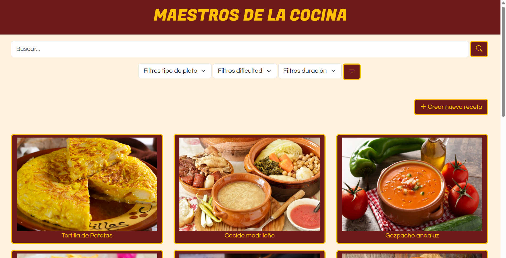
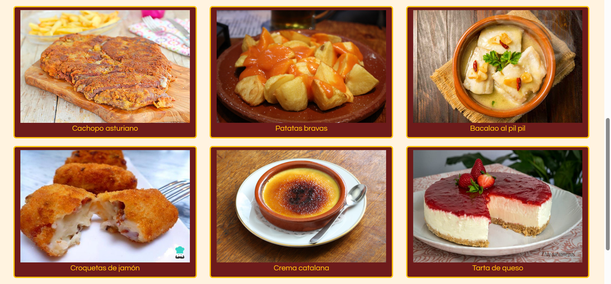
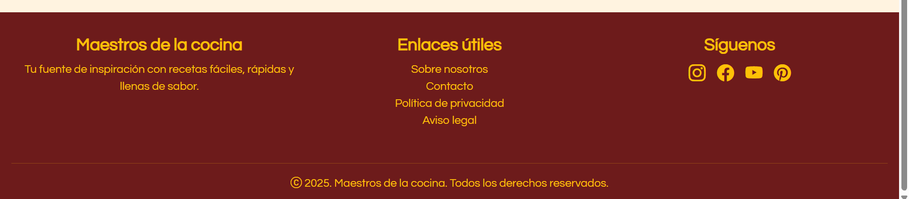

### Página de detalle: 
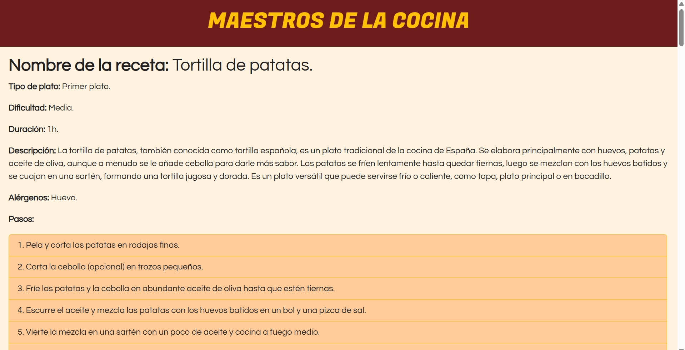
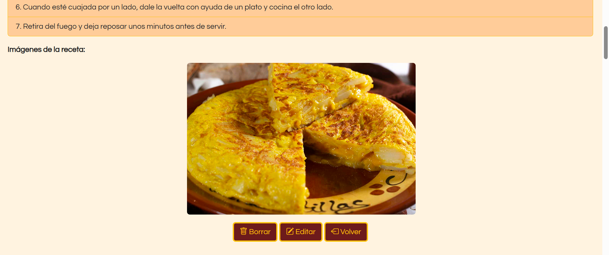
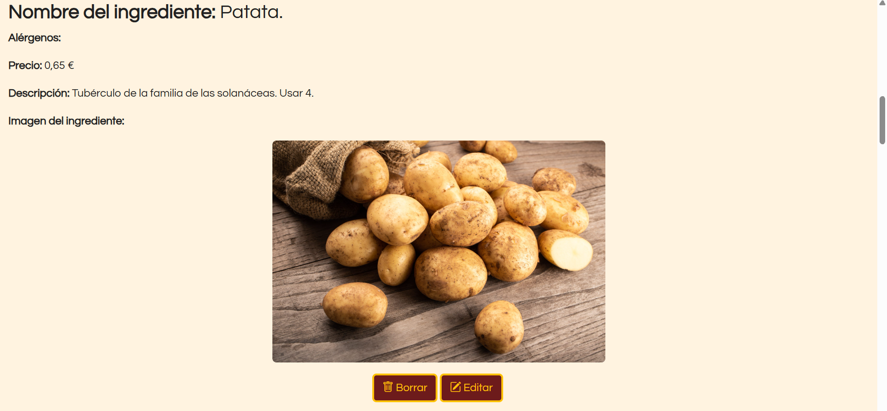
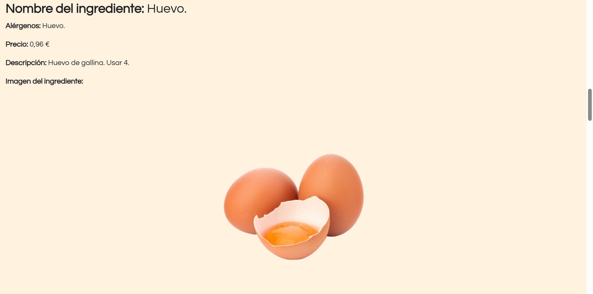
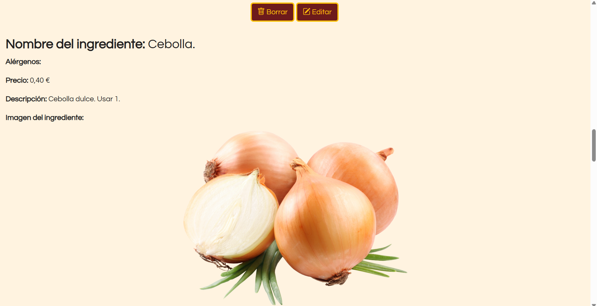
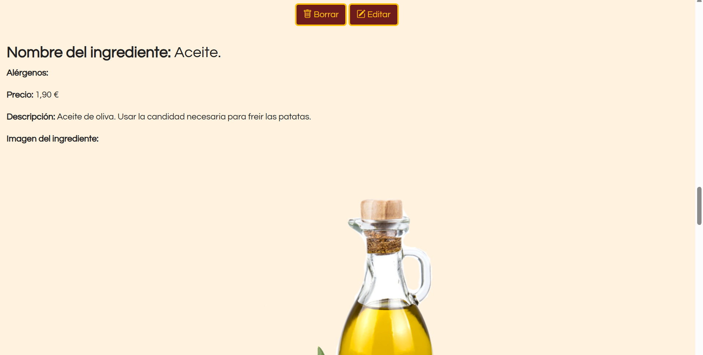
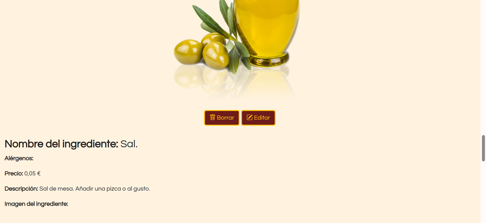
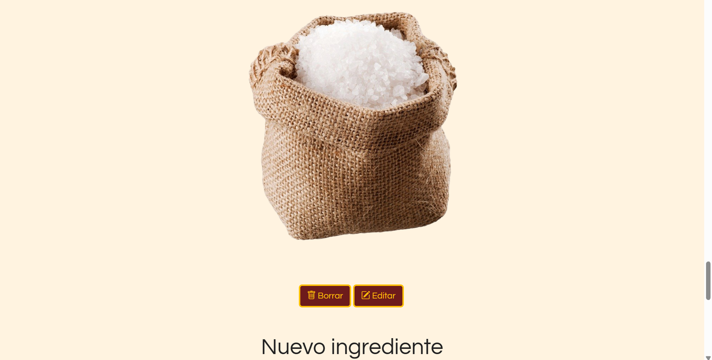
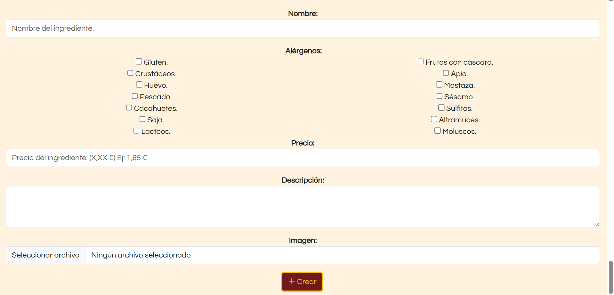

### Página de nuevo elemento:
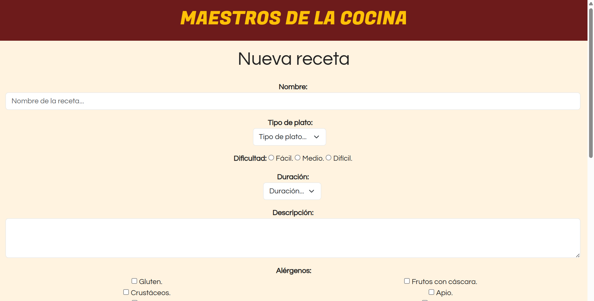
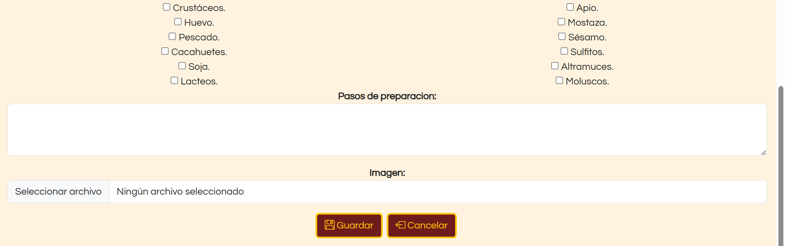

## Participación de cada miembro
### Miguel de Luis Ibáñez:
- He trabajado en la primera versión de la página de detalle (`DetailPage`), añadí el grid de Bootstrap para el diseño responsive y el footer en la página principal (`MainPage`), realicé los formularios de: 1) Nueva Receta (`NewItemPage`) y 2) Nuevo Ingrediente (`DetailPage`) con Bootstrap para que sean ambos responsive. Solucioné errores en los botones del footer de la página de detalle, posteriormente actualicé los formularios con especificaciones y añadí la opción de añadir imagenes y por último añadí las fuentes de las letras tanto como para el header como para el resto.

- Los commits más importantes que he hecho son:

1) Formulario de nuevo ingrediente  (https://github.com/CodeURJC-FW-2025-26/webapp03/commit/58d87f89f3f2890d4958b738841a5ce0ab6d00bc)

2) Formulario de nueva receta (https://github.com/CodeURJC-FW-2025-26/webapp03/commit/737bb647b2104d6d09ada8e16896e4b3db8748e3)

3) Primer modelo de la página de detalle (https://github.com/CodeURJC-FW-2025-26/webapp03/commit/fb15179145e38c3c5eea7475623011505bd077a3)

4) Grid y footer de la página principal (https://github.com/CodeURJC-FW-2025-26/webapp03/commit/08b16050227faed5b7105703171e34a616f0a41e)

5) Añadir imágenes (https://github.com/CodeURJC-FW-2025-26/webapp03/commit/de5bc34a86803f2980ce5f8c1e423d906e7504b4)

- Los ficheros en los que más he trabajado son:

1) `DetailPage` (https://github.com/CodeURJC-FW-2025-26/webapp03/blob/main/DetailPage.html)

2) `MainPage` (https://github.com/CodeURJC-FW-2025-26/webapp03/blob/main/MainPage.html)

3) `NewItemPage` (https://github.com/CodeURJC-FW-2025-26/webapp03/blob/main/NewItemPage.html)

4) `Styles` (CSS) (https://github.com/CodeURJC-FW-2025-26/webapp03/blob/main/Styles.css)

5) `README` (https://github.com/CodeURJC-FW-2025-26/webapp03/blob/main/README.md)

### Lucas Román Jiménez:
- Hice la primera versión del formulario de la página de nuevo elemento (`NewItemPage`) en html. También añadí los footers finales de las tres páginas (`NewItemPage`, `DetailPage` y `MainPage`). He realizado gran parte de los ejemplos de ingredientes, agregando imágenes y rellenando los campos de texto con la información de cada uno. Implementé el Bootstrap en parte de la página de detalle (`DetailPage`). Y por último corregí errores en la información que aparece en los ingredientes y recetas.

- Los commits más importantes que he hecho son:

1) Footer definitivo de todas las páginas (https://github.com/CodeURJC-FW-2025-26/webapp03/commit/19558b0144c69fe7eb1a557b548b68e065246462)

2) Primera versión del formulario de nueva receta (https://github.com/CodeURJC-FW-2025-26/webapp03/commit/01a68c5a8da9e582447fd9c03bc78e145fceae49)

3) Introducir en la página de detalle el Bootstrap (https://github.com/CodeURJC-FW-2025-26/webapp03/commit/87944566dbfd9da0cd2d705a51dbcc520d764dbd)

4) Añadir imagenes para los ingredientes (https://github.com/CodeURJC-FW-2025-26/webapp03/commit/e2c093a7339551f41940f4e457b4795a329e6a6d)

5) Arreglar errores en el texto de las recetas (https://github.com/CodeURJC-FW-2025-26/webapp03/commit/8df4ab2bf57ff1f88d246a3f7c47020b762165cf)

- Los ficheros en los que más he trabajado son:

1) `NewItemPage` (https://github.com/CodeURJC-FW-2025-26/webapp03/blob/main/NewItemPage.html)

2) `DetailPage` (https://github.com/CodeURJC-FW-2025-26/webapp03/blob/main/DetailPage.html)

3) `Styles` (CSS) (https://github.com/CodeURJC-FW-2025-26/webapp03/blob/main/Styles.css)

4) `MainPage` (https://github.com/CodeURJC-FW-2025-26/webapp03/blob/main/MainPage.html)

5) `README` (https://github.com/CodeURJC-FW-2025-26/webapp03/blob/main/README.md)

### Hugo García Palomo:
- Me he encargado de gran parte de los estilos, mediante el archivo CSS correspondiente (`Styles`) y aplicando las clases y estilos de Bootstrap necesarios, así como revisar su correcta aplicación en cada página. También he diseñado los botones en general de todas las páginas y los elementos del grid, la barra de busqueda y los filtros de la página principal (`MainPage`). Finalmente me he encargado de la revisión y corrección de errores de mayor o menor importancia en cada uno de los archivos.

- Los commits más importantes que he hecho son:

1) Añadir barra de búsqueda y selectores de filtros, además de corrección de errores (https://github.com/CodeURJC-FW-2025-26/webapp03/commit/e83014d4bb806092a3784b4a0c9f83b1276b17bf)

2) Mejoras de estilos y del footer, además de la organización del código (https://github.com/CodeURJC-FW-2025-26/webapp03/commit/aa66079143da89e6f5422cd3f07a2ebdbaf35830)

3) Mejoras de los botones y los formularios para adaptarse a la descripción del README (https://github.com/CodeURJC-FW-2025-26/webapp03/commit/1142a5cc0e714a9845bc0ba40990d51da8926496)

4) Boton de crear nuevo elemento y botones con imagenes (https://github.com/CodeURJC-FW-2025-26/webapp03/commit/d0872a068ad584555f7fe862457f28c2a20dd2e2)

5) Mejoras en el grid, pruebas de imagenes y correción de colores (https://github.com/CodeURJC-FW-2025-26/webapp03/commit/e3a497e95215755aa6de13425e9b24727073793f)

- Los ficheros en los que más he trabajado son:

1) `MainPage` (https://github.com/CodeURJC-FW-2025-26/webapp03/blob/main/MainPage.html)

2) `Styles` (CSS) (https://github.com/CodeURJC-FW-2025-26/webapp03/blob/main/Styles.css)

3) `NewItemPage` (https://github.com/CodeURJC-FW-2025-26/webapp03/blob/main/NewItemPage.html)

4) `DetailPage` (https://github.com/CodeURJC-FW-2025-26/webapp03/blob/main/DetailPage.html)

5) `README` (https://github.com/CodeURJC-FW-2025-26/webapp03/blob/main/README.md)

